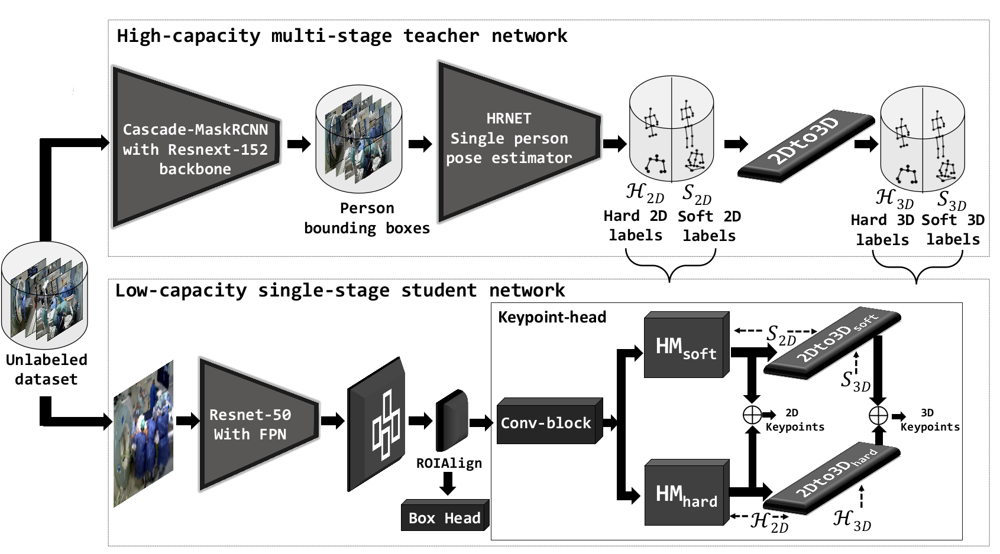

<div align="center">
<a href="http://camma.u-strasbg.fr/">

</a>
</div>

# ORPose-Color

**Self-supervision on Unlabelled OR Data for Multi-person 2D/3D Human Pose Estimation (MICCAI-2020)**

_[Vinkle Srivastav](https://vinkle.github.io/), Afshin Gangi, Nicolas Padoy_

This repository contains the inference demo.

[](https://arxiv.org/abs/2007.08354) [](https://colab.research.google.com/github/CAMMA-public/ORPose-Color/blob/master/orpose_color_demo.ipynb)

<br/>

<p float="center">  </p>

**Output of the _orpose_fixed_12x_ model on very low resolution (12x, 53x40) operating room images.**  

## Introduction
We propose a self-supervised approach for joint 2D/3D HPE from monocular RGB images to train an end-to-end and easily deployable model for the OR. We utilize the knowledge distillation in a teacher/student framework to harness the knowledge present in a large-scale unlabelled dataset and in an accurate but complex multi-stage teacher network to train a lightweight single-stage student model.

The teacher network is a three-stage to generate high quality detections. The first stage uses the cascade-mask-rcnn to generate person bounding boxes, the second stage estimates the 2D keypoints for each bounding box using the HRNet architecture after discarding low-score bounding boxes, and the third stage lifts the detected
2D keypoints to the 3D using a residual-based 2-layer fully-connected network. We construct two sets of pseudo labels: hard and soft labels. The hard labels consist of high confidence keypoints and the soft labels consist of all the key points along with their confidence values.

The student network is an end-to-end single stage network based on MaskRCNN that jointly predicts the 2D and 3D poses. The mask head of the MaskRCNN network is replaced with a keypoint-head for joint 2D and 3D pose estimation. The keypoint-head accepts the fixed size proposals from the ROIAlign layer and passes them through 8 conv-block layers to generate the features. These features are upsampled using a deconv and bi-linear upsampling layer into two branches to generate 17 channel heatmaps corresponding to each body joint. The first branch upsamples the features to generate hard heatmaps, and the second branch upsamples them to generate soft heatmaps. These hard and soft heatmaps are connected to 2D to 3D networks to lift the incoming 2D keypoints to 3D. We train the student network using these pseudo hard and soft labels on the original size and down-sampled images with downsampling ratio up to 12x. 

Results on the _MVOR+_ dataset show that the proposed student network performs on par with complex teacher network despite being a lightweight and single-stage network. Furthermore, it can also yield accurate results on low-resolution images, as needed to ensure privacy, even using a downsampling rate of 12x.

<p float="center">  </p>

## Demo on the local computer
#### Installation
You need to have a [Anaconda3](https://www.anaconda.com/products/individual#linux) installed for the setup. We developed the code on the Ubuntu 16.04, Python 3.7, PyTorch 1.5.1, CUDA 10.1 using the NVIDIA Tesla V100 GPU. 
```sh
> sudo apt-get install ffmpeg 
> ORPose_Color=/path/to/ORPose_Color/repository
> git clone https://github.com/CAMMA-public/ORPose-Color.git $ORPose_Color
> cd $ORPose_Color
> conda create -n orpose_color_env python=3.7
> conda activate orpose_color_env
# install dependencies
# install lateset version of pytorch or choose depending on your cuda environment (needs pytorch > 1.0)
(orpose_color_env)> conda install pytorch torchvision cudatoolkit=10.2 -c pytorch 
(orpose_color_env)> conda install -c conda-forge scipy tqdm yacs pycocotools opencv
(orpose_color_env)> conda install jupyterlab
(orpose_color_env)> pip install --ignore-installed pyyaml==5.1 
(orpose_color_env)> pip install pycocotools==2.0.1
# To install Detectron2, please follow the official installation instructions (https://github.com/facebookresearch/detectron2/blob/master/INSTALL.md)
# Or run the below command to install detectron2 (for CUDA 10.1 + pytorch 1.5)
(orpose_color_env)> pip install detectron2==0.2 -f https://dl.fbaipublicfiles.com/detectron2/wheels/cu101/torch1.5/index.html
# download the models
(orpose_color_env)> wget https://s3.unistra.fr/camma_public/github/ORPose/models.zip
(orpose_color_env)> unzip models.zip && rm models.zip
```
#### To run the demo open the 'orpose_color_demo.ipynb' notebook file in jupyter lab
```sh
(orpose_color_env)> jupyter lab 
```

## Demo on the Google colab
If you do not have a suitable environment to run the code, then you can also run the demo code on the Google Colab.

[](https://colab.research.google.com/github/CAMMA-public/ORPose-Color/blob/master/orpose_color_demo.ipynb)

## Citation
```bibtex
@inproceedings{srivastav2019human,
  title={Self-supervision on Unlabelled OR Data for Multi-person 2D/3D Human Pose Estimation},
  author={Srivastav, Vinkle and Gangi, Afshin and Padoy, Nicolas},
  booktitle={International Conference on Medical Image Computing and Computer-Assisted Intervention},
  year={2020},
  organization={Springer}
}
```

## License
This code, models, and datasets are available for non-commercial scientific research purposes as defined in the [CC BY-NC-SA 4.0](https://creativecommons.org/licenses/by-nc-sa/4.0/). By downloading and using this code you agree to the terms in the [LICENSE](LICENSE). Third-party codes are subject to their respective licenses.

## References
The project is built on top of [detectron2](https://github.com/facebookresearch/detectron2/). We thank the authors of detectron2 for releasing the library. 
